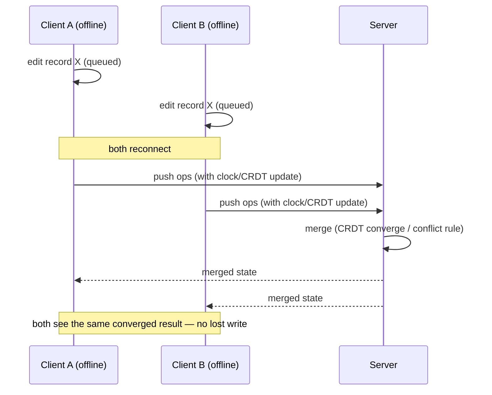

# Project 06 — Offline-First PWA with Sync + Conflict Resolution

**One-line pitch:** A web app that keeps working with zero connectivity, queues every change locally, and — on reconnect — merges concurrent edits correctly instead of silently overwriting someone's work. Real bidirectional sync, not a cached shell.

---

## 0. Honest positioning — read this first

The rare signal here is **correct conflict resolution**, not "it works offline." Most "offline support" in portfolios is a service worker caching the app shell so it *loads* offline — but it can't safely reconcile concurrent writes. The moment two clients (or two tabs) edit the same record while disconnected, naive "last-write-wins" destroys data. Demonstrating **CRDT-based (or well-designed OT) merge with an offline queue and a visible conflict-resolution story** is genuinely senior distributed-systems work wearing a web-app costume.

**Pick your conflict model deliberately** (state it in the README):
- **CRDT** (Conflict-free Replicated Data Types) — automatic, mathematically-guaranteed convergence; best for collaborative text/structured data. Libraries: **Yjs**, **Automerge**. Easiest path to a *correct* result.
- **OT** (Operational Transform) — powers Google Docs; more complex to implement correctly.
- **App-level merge / LWW with vector clocks** — simplest, but you must handle conflicts explicitly (surface to user or field-level merge). Fine for forms/records; not for rich collaborative text.

**Honest headline:** *"An offline-first PWA where two clients edit the same data while disconnected and both changes survive a correct automatic merge on reconnect — with an offline mutation queue, background sync, and a conflict-resolution strategy I can explain and prove with a reproducible test."*

**Good demo domains:** field-worker inspection forms, a collaborative notes/kanban app, an offline-capable POS/inventory tool (ties to your Candela POS / Shopify client work), or a survey-collection app for low-connectivity areas (regionally relevant).

---

## 1. Problem → Solution

| | |
|---|---|
| **Problem** | Field workers, warehouse staff, or users on flaky mobile networks lose connectivity constantly. The app must keep functioning offline and, critically, reconcile changes when the network returns — without losing data when two people edited the same thing. |
| **Solution** | Local-first architecture: an IndexedDB-backed local store, an offline mutation queue, a service worker with Background Sync, and a CRDT (or well-designed merge) layer that converges concurrent edits on reconnect. Prove correctness with a reproducible concurrent-edit test. |
| **Why it's rare** | Fake offline (cache the shell) is common. **Real bidirectional sync with correct conflict handling** is a serious engineering statement few portfolios make. |

---

## 2. Architecture

```mermaid
flowchart TD
    subgraph Client (PWA)
      UI[UI reads/writes local first] --> Store[(Local store<br/>IndexedDB)]
      Store --> Q[Mutation queue<br/>pending ops]
      CRDT[CRDT doc<br/>Yjs/Automerge] --- Store
      SW[Service Worker<br/>cache + Background Sync] --> Q
    end
    Q -->|online| Sync[Sync engine]
    Sync <--> Server[Server / sync backend]
    Server --> DB[(Authoritative store)]
    Server -->|updates| Sync
    Sync -->|merge| CRDT
    CRDT -->|converged state| UI
```

**Sync lifecycle:**



---

## 3. Tech stack & frameworks

| Layer | Choice | Notes |
|---|---|---|
| App | **Next.js / React** or Vue (your stack) as a **PWA** | Installable, offline-capable. |
| Local store | **IndexedDB** via **Dexie.js** (or idb) | Structured local persistence; Dexie has a nice API + its own sync addon option. |
| CRDT / sync | **Yjs** (+ `y-indexeddb` for local persistence, `y-websocket`/`y-webrtc` for transport) or **Automerge** (+ automerge-repo) | Yjs = performant, great ecosystem; Automerge = rich JSON CRDT + repo/sync protocol. Or **ElectricSQL / PowerSync / RxDB / TinyBase** for turnkey local-first sync. |
| Service worker | **Workbox** + **Background Sync API** | Precache shell, queue failed mutations, retry on reconnect. |
| Transport | WebSocket (y-websocket) or HTTP sync endpoint | Real-time or periodic. |
| Backend | Node (your stack) or a sync provider | Authoritative store + merge/relay. |
| Server DB | Postgres / MySQL (you use MySQL) | Persist converged state. |
| Conflict UX | Custom conflict banner / field-level merge view (for non-CRDT records) | Show the strategy working. |
| Testing | Playwright (multi-context) + network throttling/offline | Reproducible concurrent-edit tests — your proof. |

---

## 4. "Datasets" here = test scenarios, not ML data

Your artifact's credibility is a **reproducible correctness test**, so design the scenarios:
- **Concurrent edit, same field** — two clients change the same value offline → converge to a defined result (CRDT) or a surfaced conflict.
- **Concurrent edit, different fields** — both survive (field-level merge).
- **Offline create → reconnect** — no duplicates (idempotent op IDs).
- **Delete vs edit race** — defined tombstone behavior.
- **Long-offline queue** — many queued ops replay correctly and in order.
- **Three-way** (A, B, server) merge.
Automate these with Playwright (two browser contexts, toggle offline) so anyone can run them.

---

## 5. Environment / fit

No GPU. You need: the PWA + a small sync backend (Node) + a DB, and Playwright for the multi-client tests. Deploy on Vercel/Netlify + a small server (or use a local-first provider's sync service for the backend).

---

## 6. Build plan (phased)

### Phase 0 — Choose the model (day 1)
Decide CRDT (Yjs/Automerge) vs app-level merge, based on the domain (collaborative text → CRDT; simple records → field-level LWW with vector clocks). Write it down.

### Phase 1 — Local-first CRUD (week 1)
- IndexedDB via Dexie; UI reads/writes local first (instant, offline).
- Make the PWA installable (manifest + service worker via Workbox).

### Phase 2 — Offline queue + background sync (week 1–2)
- Queue mutations when offline; retry via **Background Sync** on reconnect.
- Idempotent op IDs (no duplicates on replay).

**Yjs offline + sync skeleton:**
```js
import * as Y from 'yjs'
import { IndexeddbPersistence } from 'y-indexeddb'
import { WebsocketProvider } from 'y-websocket'

const doc = new Y.Doc()
new IndexeddbPersistence('app-doc', doc)              // offline persistence
const provider = new WebsocketProvider('wss://sync.example', 'room', doc) // syncs + merges
const items = doc.getArray('items')                    // CRDT type; edits converge automatically
provider.on('status', e => console.log(e.status))      // 'connected' | 'disconnected'
```

### Phase 3 — Conflict resolution (week 2)
- CRDT: convergence is automatic — build a small UI to *show* it (edit same item in two tabs offline, reconnect, watch it merge).
- Non-CRDT records: implement field-level merge + a conflict banner where truly ambiguous.

### Phase 4 — Prove it + package (week 3)
- Playwright multi-context tests for every scenario in §4.
- Demo video: two windows, both offline, conflicting edits, reconnect, correct merge.

---

## 7. Evaluation & metrics (how you prove it)

Correctness, not throughput, is the headline:
- **Convergence** — after any interleaving of offline edits + reconnects, all clients + server reach identical state (assert in Playwright).
- **No lost writes** — concurrent different-field edits both persist.
- **No duplicates** — offline creates replay idempotently.
- **Defined conflict behavior** — same-field conflicts resolve per your documented rule (or surface to the user).
- **Offline UX** — app remains fully usable with the network off (demonstrate).
- Optional: **sync latency** and **queue drain time** after long offline periods.

| Scenario | Expected | Verified by |
|---|---|---|
| Same-field concurrent edit | Converges to defined result | Playwright assert |
| Different-field concurrent edit | Both survive | Playwright assert |
| Offline create ×N → reconnect | No duplicates | Playwright assert |
| Delete vs edit race | Defined tombstone outcome | Playwright assert |

---

## 8. Shareable deliverables

1. **Live PWA demo** (installable) — open in two windows, go offline, make conflicting edits, reconnect, watch correct merge.
2. **Demo video** of the concurrent-edit merge (the "whoa" moment).
3. **Repo** with the Playwright correctness suite anyone can run (this is your proof).
4. **README / blog**: the conflict model chosen, why, the architecture diagram, and the guarantees — plus the failure mode of naive LWW you avoided.
5. Optional: a write-up comparing Yjs vs Automerge (or CRDT vs OT) for your use case.

---

## 9. Milestones & timeline

| Week | Milestone |
|---|---|
| 1 | Local-first CRUD + installable PWA offline |
| 2 | Offline queue + background sync + conflict handling working |
| 3 | Playwright correctness suite green; demo + blog shipped |

---

## 10. Common pitfalls

- **Fake offline** → caching the shell isn't sync; the bar is correct reconciliation of concurrent writes.
- **Naive last-write-wins** → silent data loss; use a CRDT or explicit conflict handling.
- **Non-idempotent replay** → duplicates on reconnect; give every op a stable client-generated ID.
- **IndexedDB quirks** → versioning/migrations and storage eviction under pressure; handle gracefully.
- **Service worker cache staleness** → version your caches; have an update strategy (skipWaiting/clientsClaim carefully).
- **Clock skew** → don't trust wall-clock time for ordering; use logical/vector clocks or CRDT metadata.
- **Unbounded CRDT growth** → Yjs/Automerge docs accumulate history; plan snapshotting/compaction for long-lived docs.
- **Multi-tab on one device** → also a concurrency source; test cross-tab (BroadcastChannel / shared persistence).

---

## 11. References

**Concepts**
- Shapiro et al., "Conflict-free Replicated Data Types" (foundational CRDT paper).
- "Local-First Software" (Ink & Switch) — the manifesto behind this whole approach.
- Operational Transform background (Google Docs / Wave) — for the OT alternative.

**Libraries / tools**
- **Yjs** (yjs.dev) + `y-indexeddb`, `y-websocket`, `y-webrtc`.
- **Automerge** (automerge.org) + automerge-repo.
- Turnkey local-first sync: **ElectricSQL**, **PowerSync**, **RxDB**, **TinyBase**, **Dexie** (+ Dexie Cloud).
- **Workbox** (service worker + Background Sync); **idb** / **Dexie.js** (IndexedDB).
- **Playwright** (multi-context offline testing).
- MDN: Service Worker API, Background Sync API, IndexedDB, Web App Manifest.

---
*Fits your stack: React/Vue + Node + MySQL; the POS/inventory or survey-collection framing ties to your Candela POS / Shopify client work and low-connectivity regional context. The "whoa, they built that?" web project.*
