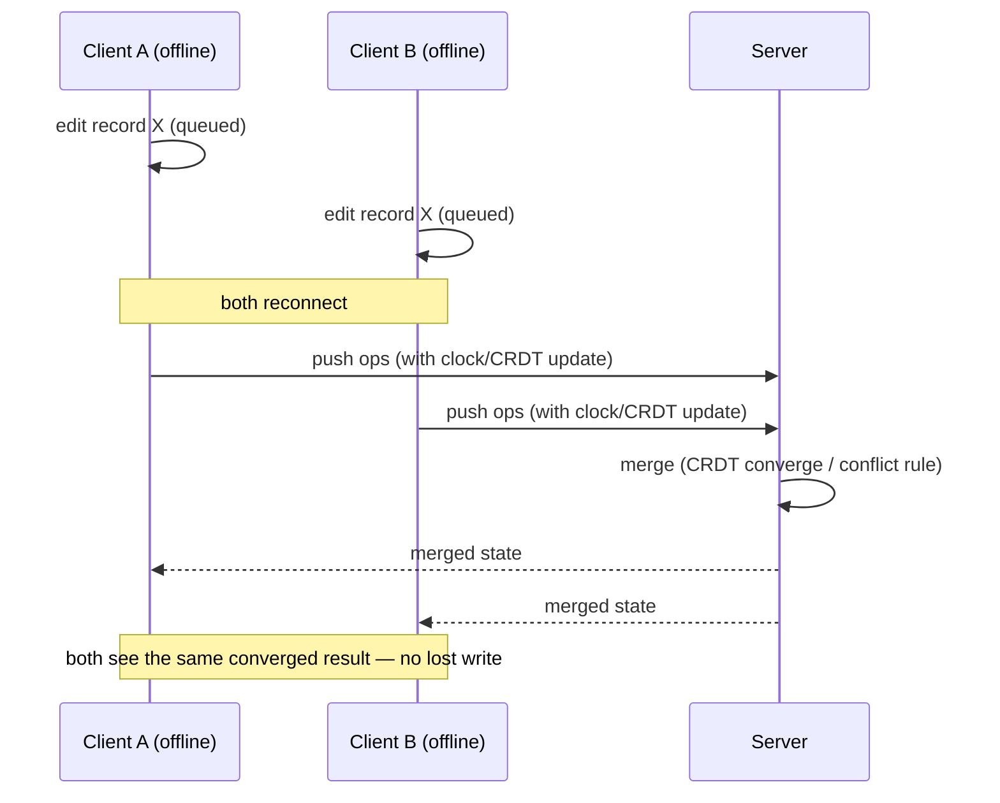

# 02 — Architecture

> The system architecture: the local-first client, the sync engine, the authoritative server, the full data/sync lifecycle, and the key design decisions (with tradeoffs) behind each choice.

---

## 1. System diagram

The reference architecture from the SPEC. The whole design is **local-first**: the UI
reads and writes the local store *first* (so it is instant and works offline), and sync
happens in the background.

```mermaid
flowchart TD
    subgraph Client (PWA)
      UI[UI reads/writes local first] --> Store[(Local store<br/>IndexedDB)]
      Store --> Q[Mutation queue<br/>pending ops]
      CRDT[CRDT doc<br/>Yjs/Automerge] --- Store
      SW[Service Worker<br/>cache + Background Sync] --> Q
    end
    Q -->|online| Sync[Sync engine]
    Sync <--> Server[Server / sync backend]
    Server --> DB[(Authoritative store)]
    Server -->|updates| Sync
    Sync -->|merge| CRDT
    CRDT -->|converged state| UI
```

---

## 2. Component walkthrough

### Client (the PWA)

- **UI (reads/writes local first).** Every user action writes to the **local store
  first** and reads from it, so the interface is instant and fully functional with the
  network off. The network is never on the critical path of a user interaction. This is
  the defining property of *local-first* software.

- **Local store — IndexedDB.** Structured, durable, in-browser persistence (accessed via
  **Dexie.js** or **idb**). This is where the app's data actually lives on the device.
  Because it survives reloads and offline periods, a user can close the app on the subway
  and reopen it with all their queued work intact.

- **Mutation queue (pending ops).** When a write cannot reach the server (offline, or a
  failed request), the change is captured as an **operation** and appended to a durable
  queue. Each op carries a **stable, client-generated ID** so that replaying it on
  reconnect is **idempotent** (no duplicates). The queue preserves order so a long-offline
  session replays correctly.

- **CRDT doc (Yjs / Automerge).** For collaborative or structured data, the canonical
  state is held as a **CRDT** — a data type whose concurrent edits are guaranteed to
  converge to the same result on every replica, with no coordination. The CRDT doc is
  linked to the local store (`y-indexeddb` persists it locally) and to the sync transport
  (`y-websocket` / `y-webrtc`). For non-CRDT record data, this box is replaced by
  app-level merge logic (field-level merge + vector clocks).

- **Service Worker (cache + Background Sync).** Built with **Workbox**. It (a) precaches
  the app shell so the PWA loads offline, and (b) uses the **Background Sync API** to hold
  failed mutations and **retry them automatically when connectivity returns** — even if
  the user has since closed the tab.

### Server side

- **Sync engine.** The bridge between the client's queue/CRDT and the authoritative store.
  When online, it **pushes** the client's pending ops / CRDT updates to the server and
  **pulls** other clients' updates back down. It feeds incoming updates into the local
  CRDT so state converges.

- **Server / sync backend.** A small **Node** service (or a turnkey local-first sync
  provider). It receives ops/updates from all clients, performs the **merge** (CRDT
  converge, or applies the documented conflict rule), and relays the merged result back
  out.

- **Authoritative store (Server DB).** **MySQL / Postgres**. Persists the **converged**
  state — the durable source of truth that a fresh client can hydrate from.

---

## 3. The sync lifecycle

This sequence is the heart of the project — the exact moment two disconnected clients
edit the same record and both survive.



**Step by step:**

1. **Both clients are offline.** Each edits record X. The edit is applied locally
   (instant UX) and appended to the local **mutation queue** with a stable op ID.
2. **Both reconnect.** The service worker's Background Sync fires; the sync engine begins
   draining each queue.
3. **Push.** Each client pushes its ops — carrying a **logical/vector clock** or **CRDT
   update** (never wall-clock time) so ordering is well-defined.
4. **Merge on the server.** The server converges the CRDT (or applies the documented
   same-field conflict rule). Concurrent **different-field** edits both persist; concurrent
   **same-field** edits resolve deterministically.
5. **Broadcast.** The merged state is sent back to *both* clients.
6. **Convergence.** A and B (and the server) now hold **identical state**. No write was
   silently lost.

---

## 4. Deployment / inference path

There is **no GPU and no model inference** in this project — the "inference path" is the
**runtime sync path**:

- **Frontend (PWA):** deploy the static/SSG or SSR app on **Vercel / Netlify**. The
  service worker and manifest make it installable and offline-capable.
- **Sync backend:** a **small Node server** (WebSocket via `y-websocket`, or an HTTP sync
  endpoint) — or delegate to a **local-first provider's sync service** (ElectricSQL /
  PowerSync / Dexie Cloud) instead of hand-rolling it.
- **Database:** **MySQL / Postgres** persists the converged authoritative state.
- **Transport:** **WebSocket** for real-time convergence, or a **periodic HTTP sync**
  endpoint for simpler, batchier sync.
- **Runtime path of a write:** `UI → local IndexedDB (instant) → mutation queue → (on
  reconnect) sync engine → server merge → broadcast → all clients converge`.

Because writes never block on the network, **p50/p99 user-perceived write latency is
essentially local-storage speed**; network sync latency and queue-drain time are
*background* metrics (see [05-evaluation-metrics.md](05-evaluation-metrics.md)).

---

## 5. Key design decisions

Each decision below is a real tradeoff drawn from the SPEC. The project's credibility
depends on **choosing deliberately and writing the choice down**.

### 5.1 CRDT vs OT vs app-level merge (the central choice)

| Option | Pros | Cons | Best for |
|---|---|---|---|
| **CRDT** (Yjs / Automerge) | Automatic, mathematically-guaranteed convergence; no server-side transform logic; **easiest path to a correct result** | Docs accumulate history → growth/compaction concern; a mental model to learn | Collaborative text / structured data |
| **OT** (Operational Transform) | Powers Google Docs; compact operations | **Complex to implement correctly**; server must transform | Rich real-time text editors |
| **App-level merge / LWW + vector clocks** | Simplest to reason about; fine for forms/records | You must handle conflicts **explicitly** (surface or field-merge); wrong for rich text | Simple records, inspection forms, inventory |

**Guidance from the SPEC:** collaborative text → **CRDT**; simple records → **field-level
LWW with vector clocks**. Whatever you pick, **state it in the README** and defend it.

### 5.2 Yjs vs Automerge (if you go CRDT)

- **Yjs** — very **performant**, mature, great ecosystem (`y-indexeddb`, `y-websocket`,
  `y-webrtc`). The pragmatic default for performance-sensitive apps.
- **Automerge** — rich **JSON CRDT** with a first-class **repo/sync protocol**
  (automerge-repo); ergonomic if your data is naturally document-shaped.

A **Yjs-vs-Automerge write-up for your use case** is an explicit optional deliverable.

### 5.3 Hand-rolled sync vs turnkey local-first provider

- **Hand-rolled** (Yjs + a small Node relay) — maximal understanding and control; more to
  build and prove.
- **Turnkey** (**ElectricSQL / PowerSync / RxDB / TinyBase / Dexie Cloud**) — faster to a
  working system; less of the hard part is "yours." Reasonable if the story is the *app*,
  not the sync internals.

### 5.4 SSG vs SSR for the shell

- **SSG** (static export) — the app shell is static and trivially precacheable by the
  service worker; simplest offline story; ideal for a local-first app whose data comes
  from IndexedDB anyway.
- **SSR** — useful if you need per-request server rendering, but it complicates offline
  precaching and adds a server dependency to first paint. For a local-first PWA, **SSG for
  the shell** is usually the cleaner fit.

### 5.5 Transport: WebSocket vs periodic HTTP

- **WebSocket** (`y-websocket`) — real-time convergence; the natural fit for CRDT sync and
  the live "watch it merge" demo.
- **Periodic HTTP sync** — simpler infrastructure, batchier; fine when near-real-time is
  not required.

### 5.6 Idempotency and ordering (non-negotiable)

- Every operation gets a **stable client-generated ID** so replay on reconnect is
  idempotent (no duplicates).
- Ordering uses **logical / vector clocks or CRDT metadata** — **never wall-clock time**,
  which is subject to clock skew across devices.
- Deletes use a **defined tombstone** so a delete-vs-edit race has a documented outcome.

---

## 6. Related docs

- Requirements and scope → [03-requirements.md](03-requirements.md)
- Test scenarios that exercise every path above → [04-data-and-datasets.md](04-data-and-datasets.md)
- Metrics that prove convergence → [05-evaluation-metrics.md](05-evaluation-metrics.md)
- Code skeletons → [07-build-roadmap.md](07-build-roadmap.md)
- Definitions of CRDT/OT/LWW/vector clock/tombstone → [10-glossary.md](10-glossary.md)

---

## 7. As built

> This section records what the shipped code actually does, and the three
> decisions that mattered most. It documents the implementation; §1–§6 above
> describe the reference design and are unchanged.

**Model chosen:** hand-rolled **Yjs CRDT** sync (option "CRDT" from §5.1), with a
small Node relay (option "hand-rolled" from §5.3) over **WebSocket** (§5.5). The
demo domain is an **offline stock-count / inventory** tool. Everything below is
in `app/src/` (client), `server/src/index.mjs` (relay), and `e2e/` (proof).

### 7.1 Quantity is a delta-counter (a PN-counter on Yjs), not a register

The one place naive CRDT modelling silently loses data is a **counter**. A plain
`item.set('qty', n)` is register / last-writer-wins per key: if A (offline)
receives 5 units and B (offline) sells 3, the two `set`s race and Yjs keeps
exactly one — the other adjustment vanishes. Wrong stock.

So `qty` is **not a number** in the data model. It is a `Y.Array` of signed
delta entries `{ d, op, ts }`, and the effective quantity is the **sum** of all
deltas (`crdt/store.readItem`). `Y.Array` insertions from concurrent replicas
merge as a **union** — nothing is dropped, entries are never mutated — so every
replica sums the same multiset and converges. `10 + 5 + (−3) = 12` on A, B, and
the server. This is a **PN-counter** assembled from Yjs primitives, and it is
the single most important modelling decision in the build (proven by
`e2e/specs/qty-concurrent-adjust.spec.ts`: `+5` and `+3` offline → `+8`).

- **Cost:** the delta array grows with adjustment history.
- **Bound / GC:** acceptable for per-session stock counts; compactable with the
  same snapshot/epoch strategy as tombstones (below). The `op` ULID on each
  delta is what makes a delta **replay-idempotent** — replaying a journalled
  `adjustQty` checks whether a delta with that ULID already exists and skips it
  (`crdt/ops.replayJournal`), so replay can never double-count.

### 7.2 Tombstone GC policy (delete vs edit)

`deleteItem` **never removes the key** — it sets `deleted: true` on the item
map. The documented rule for the delete-vs-edit race (S4) is:

> **DELETE WINS FOR VISIBILITY; EDITS ARE PRESERVED UNDER THE TOMBSTONE.**

Because the delete flag and any concurrent field edit touch **different keys**
of the same `Y.Map`, both survive the merge: `deleted=true` **and** the edited
field. Every replica's list hides tombstoned items (deterministic visibility),
while the edit remains in state — auditable, and recoverable via an explicit
`restoreItem` (`deleted:false`). Proven by `e2e/specs/delete-vs-edit.spec.ts`.

**GC policy:** tombstones are **retained for the life of the room** in this
build (rooms are per-count sessions, so growth is bounded). Production
compaction would run **server-side and epoch-based**: once every known replica
has synced past a checkpoint, rebuild the room doc without tombstoned items
older than N days and start a new epoch. **Never GC on a timer alone** — a
long-offline client whose state predates the horizon must be forced to **rebase**
on the new epoch, not allowed to resurrect deleted records.

### 7.3 Journal vs. CRDT — division of labor

Two persistence layers exist on purpose, and they are **not** two sync engines:

| Concern | Owner | Why |
|---|---|---|
| Merge + convergence + transport | **Yjs** (`y-indexeddb` local, `y-websocket` wire, server relay) | The CRDT is the **authority**. `y-indexeddb` makes the app usable offline; `y-websocket` exchanges exactly the missing updates on reconnect. |
| Visible offline queue + audit trail | **Dexie mutation journal** (`queue/mutationLog.ts`) | Human- and test-inspectable evidence: `{opId, ts, type, payload, synced}`. Drives the "pending ops" badge and the audit list; lets Playwright assert "50 queued, then drained". |
| Idempotent replay proof | **Journal + stable ULIDs** | Every op's `opId` is a client-generated ULID and the journal's primary key, so appending twice is one row; `replayJournal` re-invokes the same **idempotent** CRDT effects (create checks `items.has(id)`; qty checks the delta ULID). |

The journal is **derived evidence, not the source of truth**: if it were lost,
the Yjs state would still be complete and correct. This is the deliberate split
that keeps the design honest — the CRDT does the hard distributed-systems work,
and the journal exists to make that work **visible and provable**.

### 7.4 Server relay (as built)

`server/src/index.mjs` is a **hand-rolled** `setupWSConnection` (not
`y-websocket/bin/utils`) speaking the sync + awareness protocol via
`y-protocols` + `lib0` — pure JS, no native deps. One authoritative `Y.Doc` per
room; every room's converged state is **snapshotted to `data/<room>.yss`**
(`Y.encodeStateAsUpdate`, debounced, atomic temp-file+rename) and **loaded on
boot**, so a restart never loses committed inventory. It also serves `/health`
(liveness + room census) and `GET /rooms/:room/snapshot` (a JSON export of items
in the exact client shape — used by the suite to assert the **server** replica
converged, not just the clients).

### 7.5 Proof (as built)

Every scenario in [04-data-and-datasets.md](04-data-and-datasets.md) has a
Playwright spec in `e2e/specs/`, each asserting **convergence across all
replicas (clients + server)** plus its specific guarantee (no lost writes / no
duplicates / tombstone / ordered replay). Connectivity is toggled
**deterministically** through the in-app `OfflineToggle` (which disconnects the
provider), never via flaky network-layer offline.
