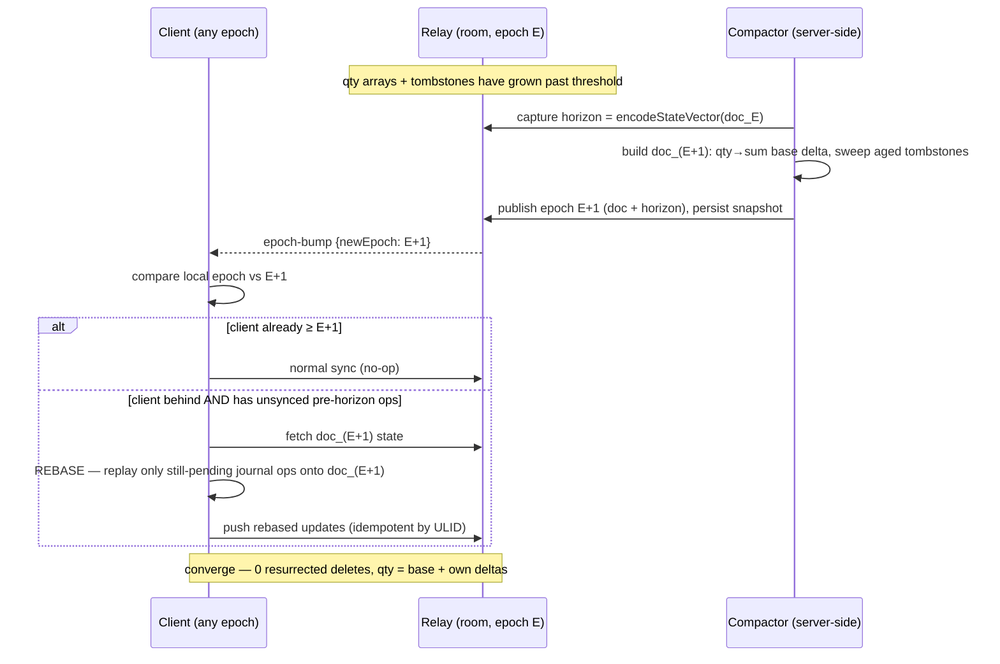
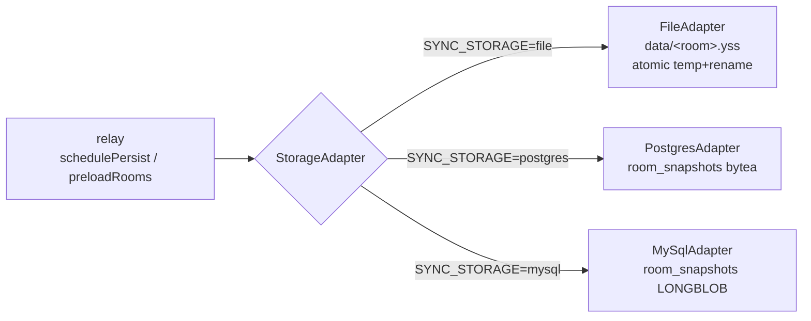
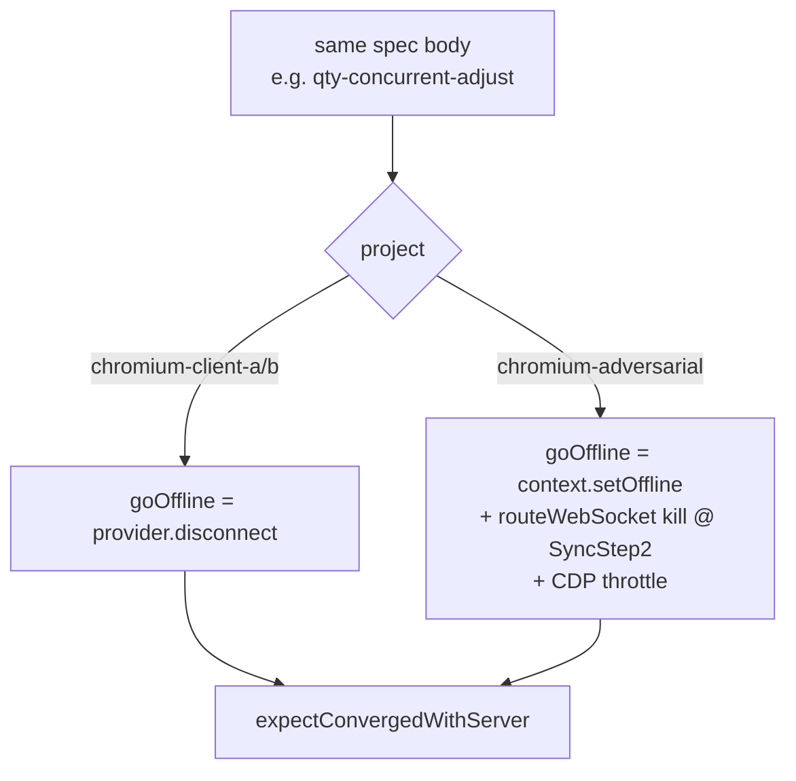
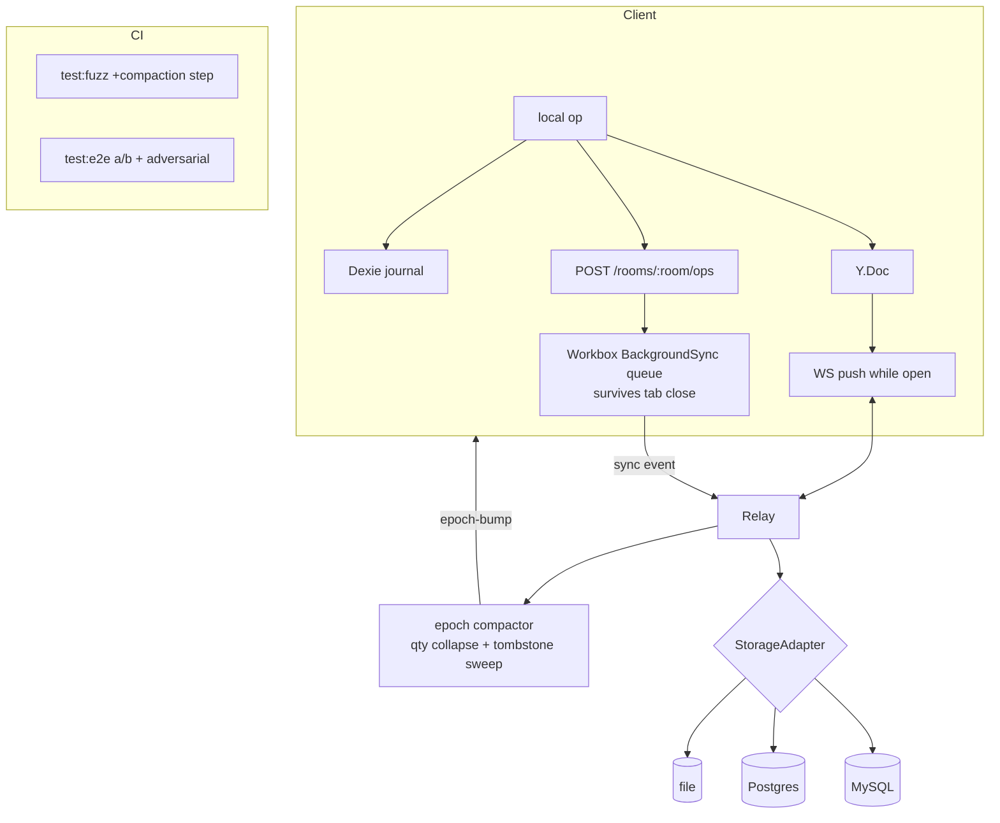

# 02 — Architecture (v2.0)

> The architectural additions v2.0 makes **on top of** the v1.0 client/relay —
> not a redesign. §1 recaps the v1.0 architecture as the fixed substrate; §2–§5
> add the epoch/compaction engine, the pluggable storage adapter, the real
> Background Sync path, and the adversarial test harness. Mermaid diagrams follow
> the Phase 1 convention ([../02-architecture.md](../02-architecture.md)).

---

## 1. The v1.0 substrate (unchanged, for reference)

Everything v2.0 adds hangs off the shipped v1.0 topology. This is fixed:

```mermaid
flowchart TD
    subgraph Client (PWA — app/src)
      UI[UI reads/writes local first] --> Doc[(Y.Doc<br/>items: Y.Map of Y.Map)]
      Doc --> IDB[(y-indexeddb<br/>inv-&lt;room&gt;)]
      Doc --- Journal[(Dexie journal<br/>inv-journal-&lt;room&gt;)]
      Doc --- BC[BroadcastChannel<br/>inv-bc-&lt;room&gt; cross-tab]
      Prov[WebsocketProvider] --- Doc
      SW[Service Worker<br/>Workbox precache + NetworkFirst api-v1] -.shell/rest.- UI
    end
    Prov <-->|ws :4444/&lt;room&gt;| Relay[Hand-rolled relay<br/>server/src/index.mjs]
    Relay --> Snap[(data/&lt;room&gt;.yss<br/>encodeStateAsUpdate)]
    Relay --> Health[/health · /rooms/:room/snapshot/]
```

Key facts v2.0 must respect:

- **`qty` is a `Y.Array<QtyDelta>`** summed to a number; **delete is `deleted:true`**
  (tombstone). Both are append-only and grow unbounded — the F1 target.
- **The Dexie journal** (`queue/mutationLog.ts`) is *derived evidence* in v1.0.
  v2.0 makes it **load-bearing** for F1 rebase and F4 background sync.
- **The relay persists via one function** — `writeSnapshot(room, doc)` calling
  `Y.encodeStateAsUpdate(doc)` — the exact seam F3 factors behind an interface.
- **Connectivity in tests** is `provider.disconnect()` via `setOffline()`
  (`crdt/store.ts`) — the clean path F2 supplements with a hostile one.

---

## 2. F1 — Epoch compaction / GC (the centrepiece)

### 2.1 Why naive compaction is wrong

You cannot simply rewrite the shared `Y.Doc` in place to drop history. Yjs
convergence depends on stable item IDs and a monotonic **state vector**; if the
server mutated the doc's structure out from under a client that still holds
pre-compaction updates, that client's next sync would **re-introduce** the very
deltas and tombstones you removed — a *resurrection* bug. v1.0 already names the
rule that forbids this (`../02-architecture.md §7.2`):

> *"Never GC on a timer alone — a long-offline client whose state predates the
> horizon must be forced to **rebase** on the new epoch, not allowed to
> resurrect deleted records."*

F1 is the faithful implementation of that sentence.

### 2.2 The epoch model

An **epoch** is an immutable checkpoint of a room's converged state. Compaction
does not edit the live doc — it **mints a fresh doc** and publishes it under a
new epoch id.

- A room is addressed as `<room>@<epoch>` on the wire (epoch `0` == the v1.0
  room name, so v1.0 clients are epoch-0 clients — backward compatible).
- The relay stores, per room: the current `epoch` integer, the current doc, and
  the **horizon** = the Yjs **state vector** captured at the moment compaction
  ran (`Y.encodeStateVector(doc)`).
- **Compacting** builds a new doc from the converged snapshot with two reductions:
  1. **qty collapse** — each live item's `Y.Array<QtyDelta>` becomes a **single
     base delta** `{ d: sum, op: 'epoch-<E>', ts }`. The effective qty is
     unchanged; the history is gone.
  2. **tombstone sweep** — items with `deleted:true` **and** untouched for longer
     than `SYNC_EPOCH_TOMBSTONE_DAYS` (default reuses `SNAPSHOT_MAX_AGE_DAYS=30`)
     are dropped entirely.
- The new doc is persisted, the epoch counter increments, and connected clients
  are told to migrate.



### 2.3 Rebase — why the Dexie journal becomes load-bearing

A pre-horizon client's *raw Yjs updates* cannot be merged into the new epoch
(that would resurrect swept records). But the client still holds a **durable,
idempotent record of its own intent**: the Dexie mutation journal
(`{opId, type, payload, synced}`). Rebase is therefore:

1. Detect epoch bump; if the local doc is behind the published epoch, enter
   **rebase mode**.
2. Adopt `doc_(E+1)` as the new base (fetch its state, `Y.applyUpdate`).
3. **Replay only the journal ops still marked `synced:0`** through the existing
   idempotent `replayJournal` machinery (`crdt/ops.ts`) — which already skips
   creates whose id exists, qty deltas whose ULID exists, deletes already
   tombstoned, etc.
4. Push the resulting updates. Because every op is ULID-keyed and idempotent, a
   rebased delta the server already has is a no-op; a genuinely-unsynced offline
   adjustment lands exactly once.

This is the deepest reuse of a v1.0 decision: v1.0 built the journal "to make the
CRDT's work *visible and provable*" (`../02-architecture.md §7.3`); v2.0 shows it
was *also* the correct substrate for safe rebase. The `op` ULID that made a delta
"replay-idempotent" in v1.0 is exactly what makes it **rebase-idempotent** here.

### 2.4 Liveness gate (do not compact too early)

Compaction is safe only when it will not strand a *reachable* client mid-history.
The compactor waits for one of:

- **All-synced gate** — every currently-connected peer's last-seen state vector
  is `≥` the checkpoint (they have all seen the history being collapsed); **or**
- **Age horizon** — the room has had no live peer for `SYNC_EPOCH_QUIESCE_MS`, so
  any returning client is by definition a rebase case and will be handled by §2.3.

A client that is *offline* during compaction is the intended rebase path and is
never a reason to block — that is the whole point of the horizon.

### 2.5 What changes in code (F1)

| File | Change |
|---|---|
| `server/src/index.mjs` | Track `epoch` + `horizon` per `WSSharedDoc`; add `compactRoom(doc)`; emit an `epoch-bump` control message; gate on the liveness rule |
| `server/src/compaction.mjs` *(new)* | Pure builder: `buildNextEpoch(doc) → { doc, horizon }` (qty collapse + tombstone sweep). Unit-testable under `node --test`, mirroring the fuzzer's pure-Node style |
| `app/src/crdt/store.ts` | Handle `epoch-bump`; enter rebase mode; expose `window.__inv.getEpoch()` for the spec |
| `app/src/crdt/ops.ts` | `replayJournal` gains a "pending-only" mode used by rebase |
| `e2e/specs/epoch-rebase.spec.ts` *(new)* | The headline F1 proof |
| `fuzz/crdt-convergence.fuzz.mjs` | Add a compaction step to the random history: compact at a random heal point, assert invariants still hold |

---

## 3. F3 — Pluggable authoritative persistence

### 3.1 The seam already exists

v1.0's persistence is two functions and one call site: `loadSnapshot(room, doc)`
and `writeSnapshot(room, doc)`, both operating on the `Y.encodeStateAsUpdate`
blob. F3 factors exactly that seam into an interface — no new serialization, the
**same bytes** everywhere.

```ts
// server/src/storage/StorageAdapter.mjs (new) — the whole surface
export interface StorageAdapter {
  load(room: string): Promise<Uint8Array | null>   // the encodeStateAsUpdate blob, or null
  save(room: string, update: Uint8Array, meta: { epoch: number }): Promise<void>
  list(): Promise<string[]>                          // rooms to preload on boot
  prune(cutoffMs: number): Promise<number>           // aged-snapshot sweep (returns count)
  close?(): Promise<void>
}
```



### 3.2 Adapters

- **`FileAdapter`** — the current behaviour, refactored verbatim behind the
  interface (atomic temp-file + rename, `.yss` files, `SNAPSHOT_MAX_AGE_DAYS`
  prune). The regression bar: the existing 16/16 suite passes unchanged with
  `SYNC_STORAGE=file`.
- **`PostgresAdapter`** — driver `pg`; one table:

  ```sql
  CREATE TABLE room_snapshots (
    room       TEXT PRIMARY KEY,
    epoch      INTEGER NOT NULL DEFAULT 0,
    snapshot   BYTEA   NOT NULL,          -- the encodeStateAsUpdate blob, verbatim
    updated_at TIMESTAMPTZ NOT NULL DEFAULT now()
  );
  ```
  `save` = `INSERT … ON CONFLICT (room) DO UPDATE`; `load` = `SELECT snapshot`;
  `prune` = `DELETE … WHERE updated_at < cutoff`.
- **`MySqlAdapter`** — driver `mysql2`; same schema with `LONGBLOB` + a
  `snapshot`/`epoch`/`updated_at` triple, `INSERT … ON DUPLICATE KEY UPDATE`.

Selection is one env var, resolved once at boot in a tiny factory
(`server/src/storage/index.mjs`): `SYNC_STORAGE=file|postgres|mysql` (+
`DATABASE_URL`), defaulting to `file` so nothing about the v1.0 run changes.

### 3.3 The multi-instance boundary (stated honestly)

A blob-in-a-row is **durable and shareable** but is *not*, by itself, live
multi-writer replication: two relay instances writing the same room row would
last-write-wins each other's snapshots between debounce flushes. F3's honest
claim is a **step toward** multi-instance, not multi-instance itself. The
documented path to true horizontal scale — out of scope to build, in scope to
describe — is to fan out **update-logs** (not whole-doc snapshots) via Postgres
`LISTEN/NOTIFY` or a message bus, so every instance applies every update. F3
lands the durable store and marks exactly where that fan-out attaches (see
[08-risks-pitfalls.md](08-risks-pitfalls.md) R-F3).

---

## 4. F4 — Real Background Sync

### 4.1 The gap and the honest shape

v1.0's SW precaches the shell and does a `NetworkFirst` cache of the REST
surface — it does **not** retry mutations. Reconnect-driven sync is
`y-websocket`, which only runs **while the tab is open**. The Background Sync API
retries **HTTP** requests from the service worker, even after the tab closes — so
F4 needs an **HTTP op-ingest path** the SW can queue against.

```mermaid
sequenceDiagram
    participant U as User (offline)
    participant P as Page / Doc
    participant J as Dexie journal
    participant SW as Service Worker (Workbox)
    participant R as Relay
    U->>P: edit while offline
    P->>J: append op {opId, type, payload, synced:0}
    P->>SW: POST /rooms/&lt;room&gt;/ops (fails — offline)
    SW->>SW: BackgroundSyncPlugin queues the POST (inv-mutations)
    Note over U,P: user CLOSES the tab
    Note over SW: device reconnects; SW 'sync' event fires
    SW->>R: replay queued POST /rooms/&lt;room&gt;/ops
    R->>R: apply ops to authoritative Y.Doc (idempotent by ULID)
    R-->>SW: 200 — op absorbed server-side
```

### 4.2 New server endpoint

`POST /rooms/:room/ops` accepts a batch of journal ops (the exact
`{opId, type, payload}` shape) and applies them to the room's `Y.Doc` via the
**same idempotent reapply logic** as `replayJournal` (shared, not duplicated).
Idempotency is free: an op whose ULID the server already merged is a no-op, so a
Background-Sync retry storm cannot double-apply. This endpoint is a *fallback
ingest*, not a second sync engine — when the tab is open, `y-websocket` remains
the primary, faster path; the HTTP queue is the safety net for the closed-tab
case.

### 4.3 Client wiring

- `app/vite.config.ts` Workbox config gains a `BackgroundSyncPlugin('inv-mutations',
  { maxRetentionTime: 24*60 })` on a route matching `POST /rooms/*/ops`.
- On each local op, in addition to the journal append and the live WS push, the
  page fires the `POST /rooms/:room/ops` — which succeeds instantly when online
  and is transparently queued by Workbox when not.
- The endpoint's applied ops flow back to open clients over WS as usual, so a
  closed-tab edit becomes visible everywhere on next connect.

### 4.4 The re-scope escape hatch

Background Sync is Chromium-only and **absent on iOS Safari / Firefox**. If the
cross-browser story cannot be made honest, F4 ships as a **documented progressive
enhancement**: the guaranteed path stays reconnect-while-open (v1.0 behaviour),
and the README states the support matrix plainly. This is a *valid completion*,
mirroring v1.0's own re-scope discipline.

---

## 5. F2 — Adversarial / lossy-network test harness

### 5.1 A third Playwright project

v1.0 runs `chromium-client-a` and `chromium-client-b`
(`e2e/playwright.config.ts`). F2 adds **`chromium-adversarial`**, which reuses
the same specs vocabulary (`e2e/helpers/clients.ts`) but swaps the connectivity
primitives from the clean in-app toggle to **real network-layer faults**:

| Fault | Mechanism (Playwright ≥1.48, already on `^1.49.1`) |
|---|---|
| **Real offline** | `context.setOffline(true)` — the browser context genuinely loses the network, not just the provider |
| **Throttling** | CDP `Network.emulateNetworkConditions` (latency + throughput caps) on the reconnect |
| **Socket kill mid-handshake** | `page.routeWebSocket()` intercepts the `ws://…:4444/<room>` connection and **closes it during `SyncStep2`**, then lets the client's built-in backoff reconnect |



### 5.2 What it proves that v1.0 could not

v1.0's `setOffline()` is *instant and cannot race a half-open socket* — a virtue
for determinism, but it means the **partial-sync** code path (a handshake that
starts, transfers some updates, then dies) was **never** exercised. F2 forces
exactly that interruption and asserts the same `expectConvergedWithServer`
invariant. New specs: `net-offline.spec.ts`, `throttled-reconnect.spec.ts`,
`socket-drop-midsync.spec.ts`. The bar: identical convergence, zero flakes across
the CI repeat budget.

### 5.3 Why this does not replace the clean project

The clean projects stay — they are the fast, deterministic regression gate. The
adversarial project is the *robustness* gate. Both run in CI; a green
`chromium-adversarial` is the evidence that convergence is a property of the
protocol, not of the friendly toggle.

---

## 6. Data-flow summary (v2.0, all features)



---

## 7. Design decisions (v2.0 tradeoffs)

| Decision | Choice | Why | Alternative rejected |
|---|---|---|---|
| Compaction model | **Fresh-doc epoch + rebase** | Only safe way to drop history without resurrection; implements v1.0's stated rule | In-place `Y.Doc` surgery — resurrects on next sync |
| Rebase substrate | **Replay pending journal ops** | Journal is already durable + idempotent (v1.0) | Diffing raw Yjs updates — fragile, re-introduces swept state |
| Storage seam | **Same `encodeStateAsUpdate` blob** behind an interface | Byte-parity ⇒ adapters are trivially equivalent; zero model change | Per-adapter bespoke schema of decoded items — loses CRDT metadata |
| Multi-instance | **Durable blob now, log-fan-out documented** | Honest incremental step; avoids over-claiming | Claiming full HA off a snapshot row |
| Background sync | **HTTP op-ingest + Workbox queue**, WS stays primary | Background Sync API is HTTP-only; keeps WS speed | Trying to background-sync the WS — impossible |
| Adversarial tests | **New Playwright project, same specs** | Reuses the whole harness; isolates robustness from regression | Rewriting scenarios per network mode |

---

## 8. Related docs

- Requirements per feature → [03-requirements.md](03-requirements.md)
- The new adversarial scenarios + datastores → [04-data-and-resources.md](04-data-and-resources.md)
- Target numbers (the v2.0 money table) → [05-evaluation-metrics.md](05-evaluation-metrics.md)
- Setup for Postgres/MySQL + the new env vars → [06-environment-setup.md](06-environment-setup.md)
- The sequenced build plan → [07-build-roadmap.md](07-build-roadmap.md)
- New terms (epoch, horizon, rebase, state vector, adapter) → [10-glossary.md](10-glossary.md)
