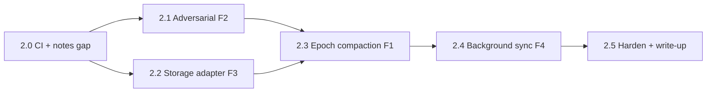

# 07 — Build Roadmap (v2.0)

> The executable, sequenced plan for v2.0: ordered milestones (Phase 2.0–2.5),
> a Definition of Done per milestone, effort/impact, and the dependencies that
> fix the ordering. This is the plan a developer follows to build Phase 2.
> Mirrors the Phase 1 roadmap ([../07-build-roadmap.md](../07-build-roadmap.md)),
> which used Phase 0–4. **All milestones are planned; none are built.**

---

## Sequencing at a glance

The order is chosen so each milestone is **independently shippable and provable**,
and so the two zero-dependency, highest-signal features (CI, then epoch/rebase)
come first.

Rationale for the edges:
- **2.0 first** — CI turns every later milestone into a continuously-proven fact,
  and the notes-gap spec is a cheap warm-up that closes a named v1.0 hole.
- **2.1 and 2.2 in parallel** — F2 (tests) and F3 (storage) are independent and
  both feed F1.
- **2.3 depends on both** — the epoch/rebase work wants the adversarial harness to
  stress it *and* the adapter refactor's clean persistence seam.
- **2.4 after 2.3** — Background Sync's `POST /ops` ingest reuses the same
  idempotent reapply path the rebase work hardens.

---

## Phase 2.0 — CI + close the notes gap (foundation)

**Objective:** make "green" a fact on every push, and close the one v1.0
coverage hole before adding surface.

**Key tasks:**
- Add `.github/workflows/ci.yml` running `npm run test:fuzz` then
  `npm run test:e2e` on push/PR (see [06-environment-setup.md §6](06-environment-setup.md#6-ci-setup-github-actions)).
- Add `e2e/specs/concurrent-notes.spec.ts` (S11) exercising concurrent `editNotes`
  `Y.Text` merge — the `ops.editNotes` path v1.0 shipped but never tested.

**Definition of Done:**
- CI is green on push, running the existing 16 runs + the fuzzer.
- The notes spec is green under both clean chromium projects.

**Effort:** S · **Impact:** High (unblocks continuous proof for everything after).
**Depends on:** nothing.

---

## Phase 2.1 — Adversarial / lossy-network project (F2)

**Objective:** prove convergence is a property of the protocol, not the clean
toggle.

**Key tasks:**
- Add a `chromium-adversarial` project to `e2e/playwright.config.ts`.
- Extend `e2e/helpers/clients.ts` with hostile connectivity primitives:
  `goOffline`/`goOnline` variants using `context.setOffline`, a CDP throttle
  helper (`Network.emulateNetworkConditions`), and a `routeWebSocket` helper that
  closes the socket during `SyncStep2`.
- Add specs: `net-offline.spec.ts` (NET1), `throttled-reconnect.spec.ts` (NET2),
  `socket-drop-midsync.spec.ts` (NET3), and a flapping variant (NET4).
- Wire `--repeat-each=5` on the adversarial specs in CI.

**Definition of Done:**
- All S1–S7 guarantees re-pass under `chromium-adversarial`, including a socket
  killed mid-`SyncStep2`, with **0** flakes across `repeat-each=5`.
- The clean projects are unchanged and still 16/16.

**Effort:** M · **Impact:** High (robustness signal; no new deps).
**Depends on:** 2.0 (to run it in CI).

---

## Phase 2.2 — Pluggable storage adapter (F3)

**Objective:** factor persistence behind an interface and reach a SQL store, byte
for byte.

**Key tasks:**
- Introduce `server/src/storage/StorageAdapter.mjs` (the interface) and
  `server/src/storage/index.mjs` (env-driven factory).
- Refactor v1.0's `loadSnapshot`/`writeSnapshot`/prune into `FileAdapter` —
  **behaviour-preserving** (atomic temp+rename, `.yss`, age prune).
- Implement `PostgresAdapter` (`pg`) and `MySqlAdapter` (`mysql2`) over the
  `room_snapshots` schema, writing the **same** `encodeStateAsUpdate` blob.
- Add `server/test/adapter-parity.test.mjs` (`node --test`): byte-equal blob +
  identical `exportItems` across adapters; a durable-restart check.
- Document (not build) the multi-writer boundary and the log-fan-out path.

**Definition of Done:**
- The existing 16/16 suite passes unchanged with `SYNC_STORAGE=file`.
- `postgres` and `mysql` adapters produce **byte-identical** state and reload it
  after a restart.
- The adapter-parity test is green in a Postgres CI job.

**Effort:** M · **Impact:** High (aligns with the SPEC's named DB; scale path).
**Depends on:** 2.0.

---

## Phase 2.3 — Epoch compaction + rebase (F1, the centrepiece)

**Objective:** bound growth without ever costing a correctness guarantee — the
most senior distributed-systems milestone in the repo.

**Key tasks:**
- `server/src/compaction.mjs` — pure `buildNextEpoch(doc) → { doc, horizon }`
  (qty collapse to one base delta/item; sweep aged tombstones). Unit-test under
  `node --test`.
- Wire the relay: per-room `epoch` + `horizon`; the liveness gate (all-synced or
  quiesced); the `epoch-bump` control message; persist the new epoch via the F3
  adapter.
- Client rebase (`app/src/crdt/store.ts`): detect epoch bump; adopt the new epoch
  doc; enter rebase mode. `app/src/crdt/ops.ts`: a **pending-only** `replayJournal`
  mode; expose `window.__inv.getEpoch()`.
- `e2e/specs/epoch-rebase.spec.ts` (S9) — the headline proof; plus S8
  (state-preserving) and S10 (no premature compaction).
- Extend `fuzz/crdt-convergence.fuzz.mjs` with a random compaction point and the
  **no-resurrection** invariant.

**Definition of Done:**
- A compacted room + a pre-horizon client rebase to identical converged state,
  **0** resurrected records, `qty = base + own deltas` (S9 green).
- Snapshot-size bounding target met on the `L=100, A=10 000` workload
  (≥ 99 % fewer deltas; see [05-evaluation-metrics.md](05-evaluation-metrics.md)).
- The fuzzer stays green over ≥ 1500 histories **with** compaction enabled.

**Effort:** L · **Impact:** Very High (the deepest capability; implements the
rule v1.0 only *documented*).
**Depends on:** 2.1 (to stress it) and 2.2 (clean persistence seam).

---

## Phase 2.4 — Real background sync (F4)

**Objective:** make an offline edit survive tab close — or re-scope honestly.

**Key tasks:**
- Server: `POST /rooms/:room/ops` applying a batch of journal ops via the shared
  idempotent reapply (reuse the `replayJournal` core hardened in 2.3).
- Client: fire `POST /rooms/:room/ops` alongside the journal append + WS push;
  add a Workbox `BackgroundSyncPlugin('inv-mutations')` route in
  `app/vite.config.ts` (gated by `VITE_ENABLE_BG_SYNC`).
- Test: an offline op, tab closed, context reconnected → op appears in
  `/rooms/:room/snapshot` (Chromium); an idempotency check on retry.
- **Decision point:** if cross-browser Background Sync cannot be made honest,
  ship the README re-scope with the browser-support matrix and keep
  reconnect-while-open guaranteed.

**Definition of Done:**
- Post-tab-close delivery passes on Chromium **or** the honest re-scope is
  documented; idempotent ingest verified; WS remains primary while open.

**Effort:** M · **Impact:** Medium–High (closes the last SPEC deliverable, with a
valid re-scope fallback).
**Depends on:** 2.3 (shared idempotent ingest).

---

## Phase 2.5 — Harden + write-up

**Objective:** turn the four features into a coherent, reviewable release.

**Key tasks:**
- Fold the new specs/projects into CI; confirm the whole matrix is green
  (fuzz + a/b + adversarial + Postgres adapter job).
- Update `RUNBOOK.md` with the SQL storage and adversarial-project commands.
- Write the v2.0 blog/section: the epoch/rebase diagram, the "socket drop
  mid-`SyncStep2`" story, and the adapter-parity table.
- Re-scan every doc for target-vs-measured labelling before publishing.

**Definition of Done:**
- CI green across the full matrix; RUNBOOK + write-up updated; all numbers
  correctly labelled target/measured.

**Effort:** S · **Impact:** High (packaging is the deliverable).
**Depends on:** 2.0–2.4.

---

## Milestone summary

| Phase | Feature | Effort | Impact | Depends on | Headline DoD artifact |
|---|---|---|---|---|---|
| **2.0** | CI + notes gap | S | High | — | `ci.yml` green; `concurrent-notes.spec.ts` |
| **2.1** | Adversarial (F2) | M | High | 2.0 | `chromium-adversarial` green, 0 flake |
| **2.2** | Storage adapter (F3) | M | High | 2.0 | adapter-parity byte-identical |
| **2.3** | Epoch compaction (F1) | L | Very High | 2.1, 2.2 | `epoch-rebase.spec.ts` green |
| **2.4** | Background sync (F4) | M | Med–High | 2.3 | tab-close delivery **or** re-scope |
| **2.5** | Harden + write-up | S | High | 2.0–2.4 | full CI matrix green |

---

## Phase → deliverable trace

| Phase | Produces | Deliverable |
|---|---|---|
| 2.0 | Continuous proof + closed notes gap | CI badge; S11 |
| 2.1 | Robustness under real faults | `chromium-adversarial` project |
| 2.2 | Durable, DB-backed, scalable-path storage | `StorageAdapter` + SQL adapters |
| 2.3 | Bounded growth + safe rebase | epoch engine + `epoch-rebase.spec.ts` |
| 2.4 | Tab-close durability (or honest re-scope) | Workbox queue + `/rooms/:room/ops` |
| 2.5 | A coherent v2.0 release | write-up + green CI matrix |

---

## Definition of Done (whole of v2.0)

- Every v1.0 guarantee still holds — after compaction, through an interrupted
  handshake, against a SQL store, and across a closed tab (or the F4 limitation
  is documented).
- `epoch-rebase.spec.ts`, the `chromium-adversarial` project, the adapter-parity
  test, and (where honest) the tab-close test are **green in CI**.
- The property fuzzer is green over ≥ 1500 histories **with** compaction.
- Every number in the docs is labelled **target (planned)** or **baseline
  (measured)**; no target is presented as a result.

See [03-requirements.md §7](03-requirements.md#7-deliverables-checklist) for the
deliverables checklist and [05-evaluation-metrics.md](05-evaluation-metrics.md)
for how each milestone's output is measured.
